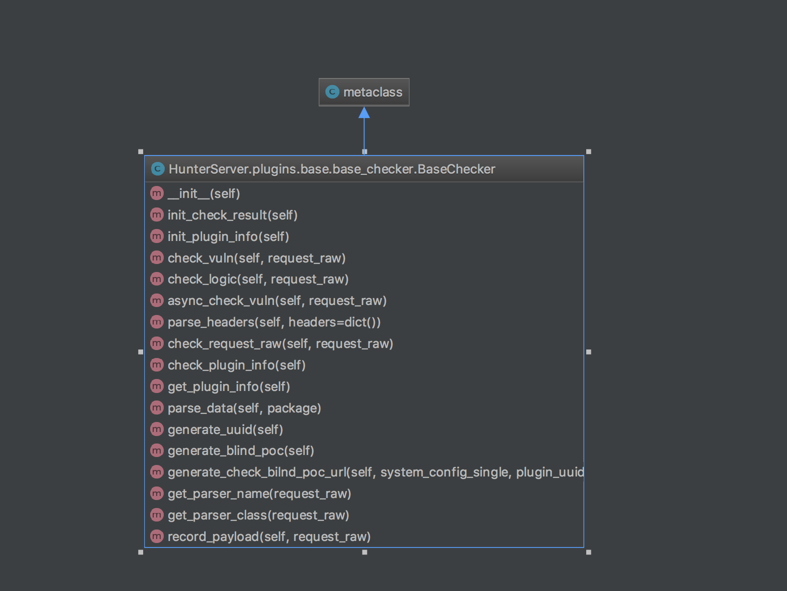

二次开发
======================

接入公司登录账号体系
---------------------
目前hunter开源版本自带两种认证模式，一种是使用hunter本地数据库中的user表的user_name和pass_word去做认证。第二种是使用ldap认证，通常情况下可以满足绝大部分公司的接入需求。
如果你想接入自己公司认证(比如hunter也有接入中通内部sso认证)，应该怎么做？主要分为如下四个步骤

1.编译一个继承BaseAuthModule的类，并自定义认证过期默认跳转路由

2.用flask实现跳转路由的相关认证和保存数据逻辑

3.在module_registration中注册默认认证模块

4.注册到flask蓝图

继承BaseAuthModule
^^^^^^^^^^^^^^^^^^^^^^^^^^^^^^^^
进入/HunterAdminApi/api/authentication/目录构建一个类并继承BaseAuthModule::

    class SsoAuthModule(BaseAuthModule):

        def __init__(self):
            redirect_uri = "http://HunterAdminApi/api/v1/sso/authorization"
            auth_redirect_url = "https://xxx.xx.com/oauth2/authorize?appid={}&redirect_uri={}&state={}".format(appid, redirect_uri, state)
            self.auth_redirect_url = auth_redirect_url

实现认证逻辑
^^^^^^^^^^^^^^^^^^^^^^^^^^^^^^^^^^^^

认证逻辑::

    from flask import request, session, jsonify, Blueprint

    sso_web_api = Blueprint('sso_web_api', __name__, url_prefix="/api/v1/sso/")

    @sso_web_api.route('/authorization/', methods=['GET'])
    def sso_authorization():
        #具体的sso认证逻辑，认证成功之后
        if UserService.count(where=(User.user_name == current_user_name)) <= 0:
            db_user = UserService.save(user_name=sso_center_user.get("username"))
        else:
            db_user = UserService.get_fields_by_where(where=(User.user_name == current_user_name))[0]
        # 存入到redis，和数据库中的数据一致，用户id是最关键的
        RedisService.update_user(current_user_name, {"id": db_user.id, "user_name": db_user.user_name})
        try:
            current_task = TaskService.get_working_tasks(user_id=db_user.id)[0]
            RedisService.update_user(current_user_name, {"current_task_id": current_task.id})
        except IndexError:
            pass
        # 设置session
        session["user_name"] = current_user_name

        #认证成功，并保存数据之后，跳转到hunter首页

注册默认认证模块
^^^^^^^^^^^^^^^^^^^^^^^^^^^^^^^^^^^^

修改HunterAdminApi/api/authentication/module_registration.py文件::

    from api.authentication.sso_auth_module import SsoAuthModule

    def get_single_auth_module():
        """
        获取单例对象
        :return:
        """
        global auto_module_instance
        if not auto_module_instance:
            with single_auto_module_lock:
                if not auto_module_instance:
                    auto_module_instance = SsoAuthModule()
        return auto_module_instance

.. note::
    注册认证模块的路由将会变成认证过期之后的默认跳转，只要路由不冲突可以存在多种认证方式

注册到flask蓝图
^^^^^^^^^^^^^^^^^^^^^^^^^^^^^^^^^^^^

修改修改HunterAdminApi/web_app.py 注入到蓝图::

    from api.authentication.sso_auth_module import sso_web_api
    flask_app.register_blueprint(sso_web_api)

开发一个检测插件
---------------------

hunter默认的HunterAdminApi中自带HunterCelery模块，所以想要二次开发时，直接在HunterAdminApi/plugins目录下开发即可。
如果你想分布式部署扫描检测引擎(hunter-consumer)，在HunterAdminApi中开发测试完成之后可以运行 bash extract_hunter_celery.sh
会提取出单独的HunterCelery模块，提取出的HunterCelery模块放入到单台机器即可独立部署。

查看/plugins/base/base_checker.py 整体结构如下

采用模版设计模式，如果想要进行开发，只需要继承BaseChecker并实现check_logic和init_plugin_info即可，如下为示例::

    class Checker(BaseChecker):
        # 检测逻辑
        def check_logic(self, request_raw):
            host, port = get_host_port(request_raw['url'])
            if port == 9012:
                self.result["status"] = True
                self.result["info"] = '%s开放了9012端口服务' % http_poc_url
                self.result['payload'] = http_poc_url

        #插件信息
        def init_plugin_info(self):
            name = "name1"
            imp_version = "< spring 2.1"
            description = "see http://xxxxx/"
            repair = "升级到xxx或者其以上版本"
            type = VulnType.OTHER
            author = "b5mali4"
            temp_info = {"repair": repair, "name": name, "type": type, "description": description,
                         "imp_version": imp_version, "author": author}
            self.info = dict(self.info, **temp_info)

将扫描结果写入到self.result字段，self.result主要结构如下(详情可见/plugins/base/base_checker.py):

================ ======= =================== ===========================
名称              类型     值                  备注
================ ======= =================== ===========================
status             bool     True                  存在该漏洞
info               str     sql注入漏洞         漏洞信息
payload            str     and 1=1              攻击payload
================ ======= =================== ===========================

接入扫描提醒方式
---------------------

hunter开源版本目前自带的扫描状态提醒方式是邮件，如果你想接入钉钉，微信，漏洞，管理平台(中通内部接入同安)，自动发布平台(CI/CD平台)或者其他提醒方式，应该怎么做？
采用观察者设计模式，想要接入主要分为如下两个步骤:

1.继承BaseObserver并实现notify函数逻辑

2.在Subject中添加订阅

具体代码实现可Hunter/notice/subject.py和Hunter/notice/subject.pyemail_observer.py