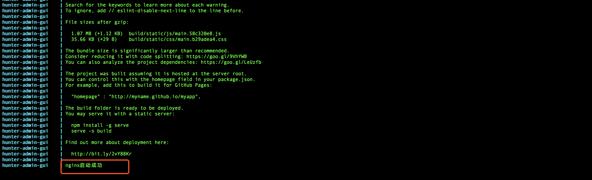
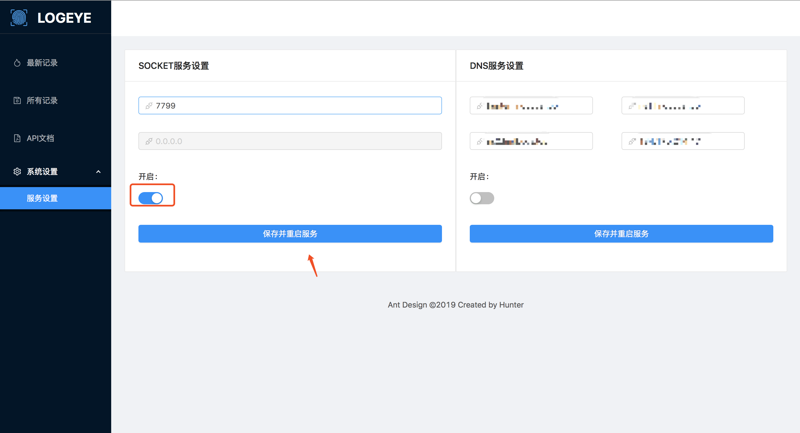

使用案例
======================

部署hunter
++++++++++++++++++++++
为了演示方便，直接跳过安装教程，使用docker进行部署安装.
1.首先下载源码https://github.com/ztosec/hunter 然后进入到docker目录下，直接运行::

    docker-compose up -d

.. note::
    出现了上面的运行日志证明前端编译运行完成了，这时可以打开后台管理。

2.登录HunterSense平台,打开http://127.0.0.1:8837/(登录账号密码admin,admin888) 并开启socket开关

3.登录HunterAdmin平台,打开http://127.0.0.1:3000/(登录账号密码hunter,hunetr) 管理设置->系统设置->回显设置，设置如下

.. image:: ../images/use/use_27.png
    :width: 800

.. note::
    注意ip不要使用127.0.0.1，要确保漏洞靶机触发回显漏洞时能访问到HunterSense平台

部署漏洞环境
++++++++++++++++++++++

1.下载漏洞环境https://github.com/stamparm/DSVW::

    git clone https://github.com/stamparm/DSVW
    cd DSVW && python dsvw.py

交互测试
++++++++++++++++++++++

1.用户下载安装插件，登录后台后即可看到用户下载

2.新建任务(详情见使用教程)

3.同步任务&测试(详情见使用教程)