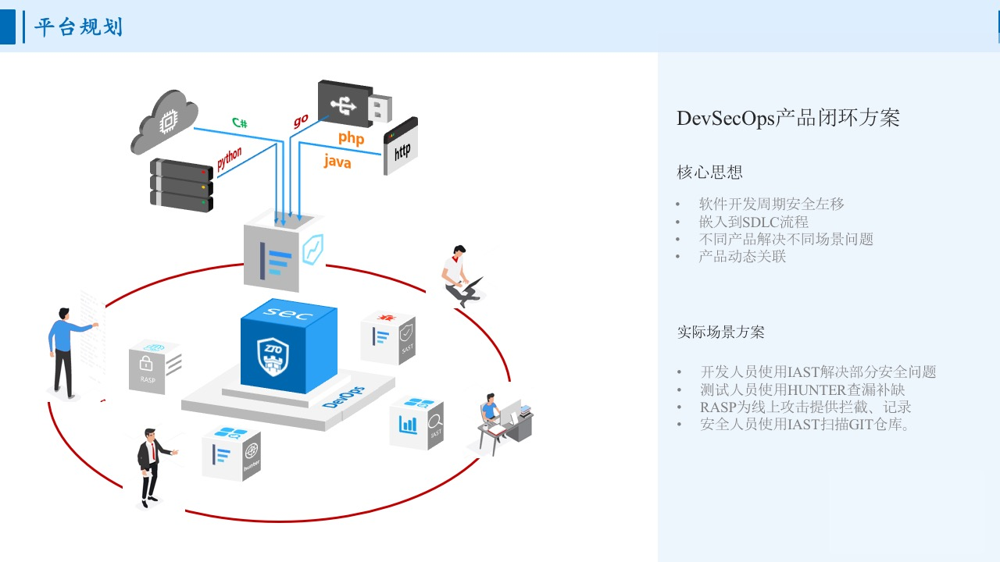
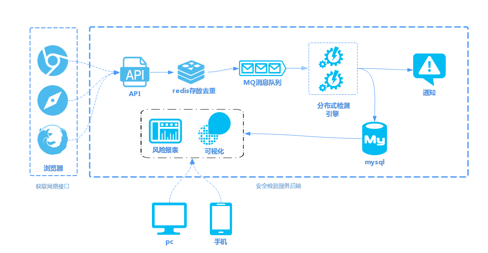
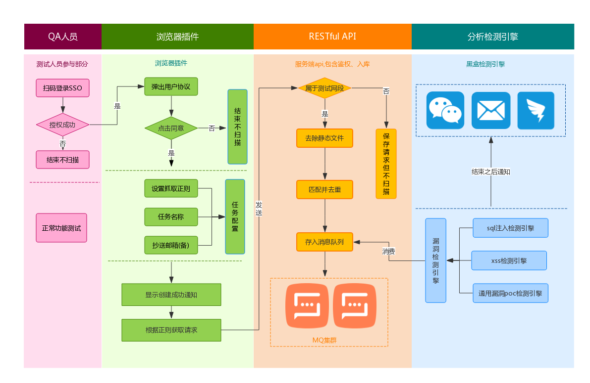

总体介绍
======================

背景介绍
----------------------

甲方安全建设中有一个很重要的环节，即业务迭代上线前的安全检测。大部分
公司的产品研发部门都会配备一个或多个质量测试工程师负责把关软件质量。
然而术业有专攻，质量测试工程师能够得心应手地应对软件功能方面的缺陷，
却由于自身安全领域专业知识的缺失导致很难识别安全风险。针对这一问题常
采用的做法就是由甲方安全人员定期对业务线进行安全检查，但这种做法有很
强的滞后性，一个业务从上线到被发现安全问题可能跨越了很长的周期。最理
想的效果是在业务上线之前能够将安全风险“扼杀”，于是很多公司在业务上
线会安排人工进行安全测试，但这种做法不够节省人力。上述提到的两个做法
都有一定的弊端，一种更好的方案是在发布流程中加入自动化安全扫描，DevSecOps整体流程如下:

*DevSecOps整体闭环*

Hunter作为中通DevSecOps中一环，发挥着及其重要的作用。

产品导读
----------------------

欢迎来到hunter文档，hunter是一款被动式漏洞扫描器，何谓被动式漏洞扫描器？

首先需要先了解下主动式漏洞扫描器，传统主动式漏洞扫描器的主要流程:

1.网络爬虫爬取网站接口。

2.对爬取到的接口进行漏洞检测。

网络爬虫主动爬取网站接口并进行漏洞检测的方式被称之为主动式漏洞检测方式。

但是主动爬虫会遗漏掉很多网站接口，为了解决这个问题，一种在用户和web应用

进行交互时获取用户网络请求接口并进行漏洞检测方式由此产生，这种漏洞检测方式被

称为被动式漏洞检测方式。

产品流程和架构图
------------------------

*产品架构图*

*流程图*

源码结构
------------------------

目前开源的源码主要分为如下七个模块::

    ├── HunterClient(客户端-浏览器插件)
    ├── HunterAdminApi(管理后台后端)
    ├── HunterAdminGui(管理后台前端)
    ├── HunterSense(回显log日志平台)
    ├── HunterCelery(poc检测引擎)
    ├── SqlmapCelery(sql注入检测引擎)
    ├── XsseyeCelery(xss检测引擎)

